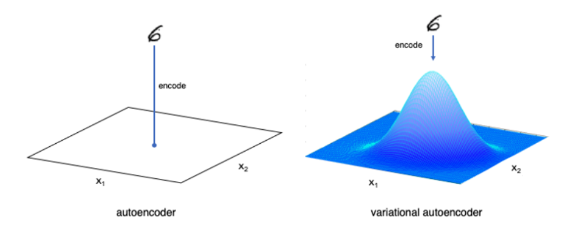
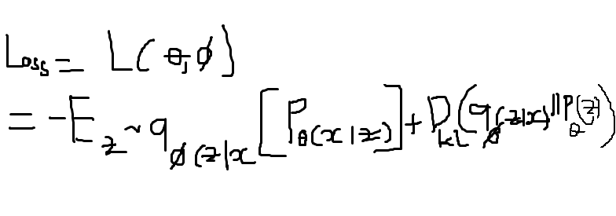

## VAE
>* VAE là một trình mã tự động có phân phối mã hóa được quy định hóa trong quá trình đào tạo để đảm bảo rằng không gian ẩn của nó có các thuộc tính tốt cho phép ta tạo một số dữ liệu mới. Hơn nữa, thuật ngữ “variational” xuất phát từ mối quan hệ chặt chẽ giữa chính quy hóa và phương pháp suy luận biến thiên trong thống kê
>* Tư tưởng chính của VAE là thay vì tìm một điểm biểu diễn trong không gian ẩn cho một điểm dữ liệu trong không gian gốc, ta sẽ đi tìm một phân phối xác suất cho điểm dữ liệu đó
>* 
## Mục đích VAE
>Đào tạo tổng quát hơn autoencode, tạo ra các mẫu rất giống với đầu vào
## Mô hình
>* 
> 
```diff
- VAE loss: 
```

>* VAE có 4 thành phần chính: encoder, decoder, mu, sigma


